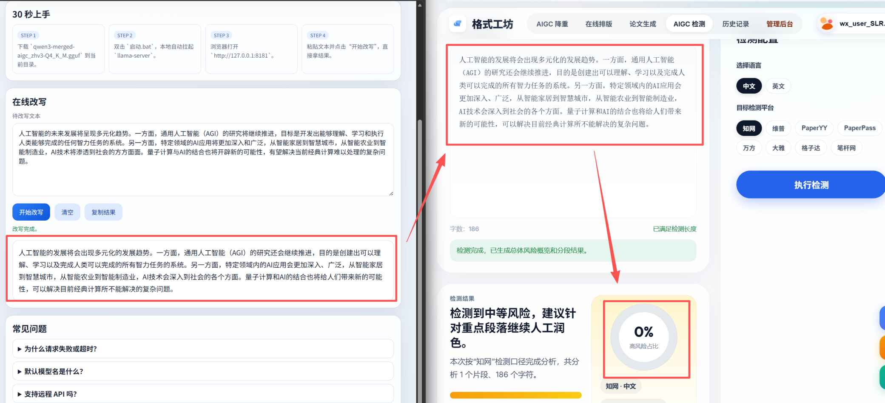

# 1.11GB 本地离线中文降AIGC改写模型：双击启动，30 秒可用

> 面向中文文本改写与润色的本地化方案。  
> 不依赖云 API，文本不出机，启动后即可通过网页或 OpenAI 风格接口调用。



这个仓库的目标很直接：

- 让中文稿件更顺、更清晰，减少重复和生硬句式。
- 用最低部署成本完成本地改写（Windows 下双击 `启动.bat`）。
- 在“可上手”与“可复用”之间保持平衡：普通用户可直接用，开发者可走 API。

## 30 秒快速开始

1. 双击运行 `启动.bat` 会自动下载环境和模型
2. 打开 `http://127.0.0.1:8181`
3. 粘贴文本并点击“开始改写”

如果第 1 步失败了，请看下一节。

## 模型下载
- Hugging Face 官方：<https://huggingface.co/skskk/aigc-rewriter/tree/main>
- 只需下载：`qwen3-merged-aigc_zhv3-Q4_K_M.gguf` 
- 下载后放在 `启动.bat` 同级目录

## 手动安装与补齐运行环境
1. 从 `llama.cpp` Windows 预编译发布页下载包含 `llama-server.exe` 的包：
   - 官方下载：<https://github.com/ggml-org/llama.cpp/releases/download/b8783/llama-b8783-bin-win-vulkan-x64.zip>
2. 在 release 资产列表里，优先选择名称包含 `bin-win-vulkan-x64` 且内含 `llama-server.exe` 的压缩包。
3. 如果机器 Vulkan 环境异常，改选名称包含 `bin-win-cpu-x64` 的 CPU 包进行验证。
4. 解压后将目录重命名为：`llama-b8721-bin-win-vulkan-x64`
5. 放到项目根目录（与 `启动.bat` 同级）。
6. 确认 `llama-server.exe` 位于：`llama-b8721-bin-win-vulkan-x64\llama-server.exe`

补齐后，再运行 `启动.bat`。

## 手动启动命令（PowerShell）

```powershell
.\llama-b8721-bin-win-vulkan-x64\llama-server.exe -m .\qwen3-merged-aigc_zhv3-Q4_K_M.gguf --host 127.0.0.1 --port 8181 --path . --reasoning off --reasoning-format none
```

查看模型列表：

```powershell
Invoke-RestMethod http://127.0.0.1:8181/v1/models
```

如果返回模型列表，说明服务可用。


## 这次微调做了什么（可核实结果）

以下信息来自本地训练/导出日志：

- 基座模型：`Qwen3-1.7B`
- 训练方式：LoRA 微调 -> 合并 -> GGUF 导出
- 最终训练样本：十万条数据集 -> 筛选`2726`条训练数据集（`diff_01_20 + dual_aigc` 筛选链路）
- 训练参数：`2 epoch / 432 step / bf16 / lr=2e-4 / LoRA r16 alpha32 dropout0.05 / seq=1024`
- 最终量化：`Q4_K_M`
- 量化体积日志：约 `3.28 GiB -> 1.05 GiB`

## 适用场景

- 中文稿件润色：优化语序与措辞，让表达更清晰。
- 重复表达整理：压缩冗余句式，统一文风。
- 本地写作辅助：适合离线处理、私有部署或内网调用。

## 故障排查

### 1) 提示缺少 `llama-server.exe`

运行时目录不完整。按“安装与补齐运行环境”补齐 `llama-b8721-bin-win-vulkan-x64`。

### 2) 提示缺少模型文件

确认根目录存在 `qwen3-merged-aigc_zhv3-Q4_K_M.gguf`，且文件名与脚本一致。

### 3) 端口 `8181` 被占用

先查占用进程：

```powershell
Get-NetTCPConnection -LocalPort 8181 -State Listen | Select-Object LocalAddress,LocalPort,OwningProcess
```

关闭占用后重试，或修改启动脚本中的端口参数。

### 4) Windows 安全策略拦截可执行文件

若被 SmartScreen/Defender 拦截，请在你信任来源前提下放行后再运行。

### 5) Vulkan 环境异常

改用 CPU 版预编译包进行验证，确认链路通后再切回 Vulkan 版本。


## 免责声明

本项目定位为中文文本改写、润色与写作辅助工具，仅用于提升表达质量、可读性与本地化处理效率。项目不面向、也不鼓励任何规避学校、平台、期刊、机构或第三方审核规则的用途，包括但不限于规避 AIGC 检测、内容识别、查重、风控或其他合规审查。作者不对使用者基于本项目生成、改写或提交的内容承担合规责任；请使用者自行遵守所在学校、平台、机构、出版社及相关法律法规要求。本项目不承诺也不宣称能够降低检测率、识别率或查重率。
